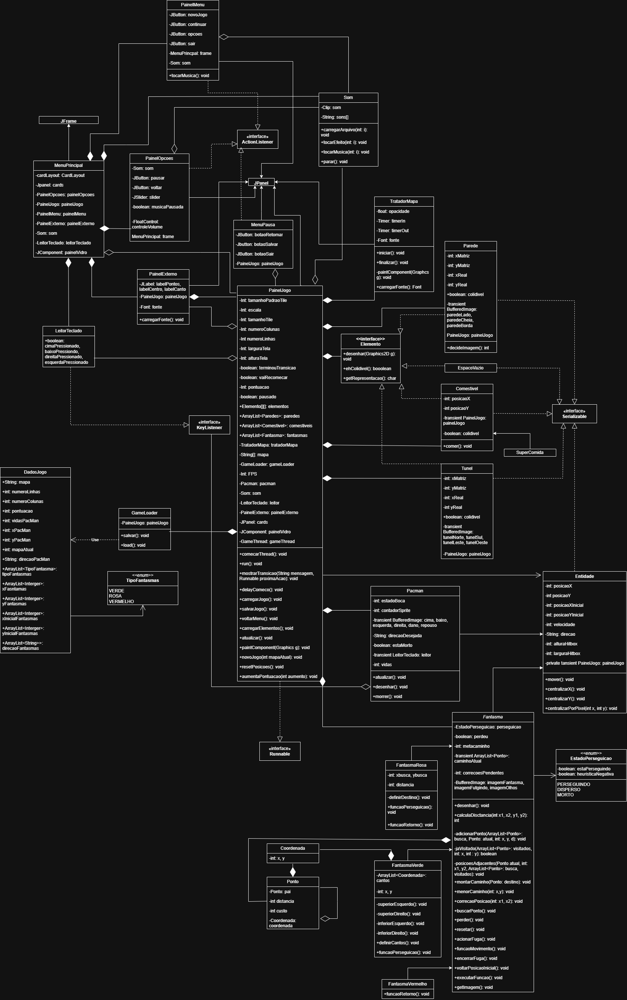

#### *Projeto final da disciplina MC322*

Feito pelos alunos: 
276617 - Lucas Henrique Bertanha 
281218 - Guilherme José de Oliveira 
281260 - João Pedro Frare 
281289 - Leonardo Ferreira 

## Execução

[...]

IDE utilizada: VS Code 
Versão do Java: 21.0.6 

## Diagrama de Classes

## O projeto
### Resumo
Trata-se de uma recriação simplificada do jogo [Pac-Man][1] usando o conhecimento de Programação Orientada a Objetos adquirida na matéria MC322 durante o semestre. 

### Funcionalidades
Foram implementadas as funções mais crucias do jogo original, como Fantasmas perseguidores, sistema de pontuação e de vidas, mapa com colisão e túneis, um meio de vencer e também de perder. Além disso, foram feitas adições como labirintos personalizáveis por leitura de arquivos, opções de pausa e de salvamento/carregamento de progresso. 

Mais informações podem ser encontradas na [Wiki][2]. 

[1]: <https://pt.wikipedia.org/wiki/Pac-Man> "Ver na Wikipédia"
[2]: <https://github.com/lucasUnicamp/projetoFinal/wiki> "Ir para a Wiki"
